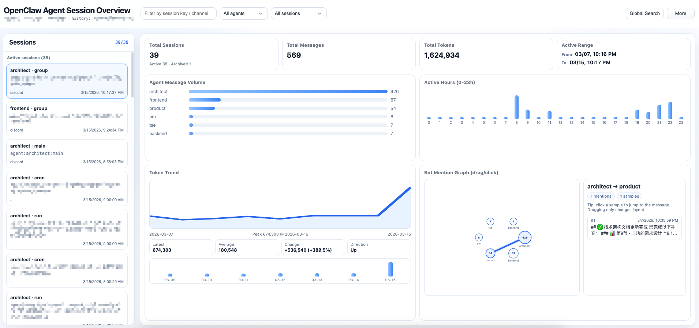

# ClawView

<p align="left">
  <a href="https://www.npmjs.com/package/clawview"></a>
  <a href="https://www.npmjs.com/package/clawview"></a>
  
  
</p>

OpenClaw 会话可视化工具。安装后运行 `clawview`，即可在浏览器中查看会话、检索内容和分析统计。  
A local visualization tool for OpenClaw sessions. Install and run `clawview` to browse, search, and analyze conversations in your browser.

[中文](#中文) | [English](#english)



---

## 中文

### 1. 功能亮点

- 聚合 `~/.openclaw/agents/*/sessions/sessions.json` 的会话数据
- 自动备份历史会话，避免 `/new` 后旧会话丢失
- 会话分组（活跃/历史）、状态筛选、跨会话全文检索
- Dashboard 统计：消息量、活跃时段、Token 趋势、Bot 提及关系
- 会话弹框支持 Markdown，工具调用/结果可折叠
- `live.html` 增量追踪实时消息流
- 本地双语界面（默认中文）

### 2. 环境要求

- Node.js `>= 18`
- Python `3.x`

### 3. 安装

```bash
npm i -g clawview
```

本地开发安装（从源码目录）：

```bash
cd /path/to/clawview
npm i -g .
```

### 4. 快速开始

```bash
clawview
```

首次执行会进入配置向导，回车可使用默认值：

| 配置项 | 默认值 |
| --- | --- |
| `host` | `127.0.0.1` |
| `port` | `8788` |
| `stateDir` | `~/.openclaw` |
| `historyRoot` | `~/.clawview` |
| `autoOpen` | `true` |

默认会自动打开：`http://127.0.0.1:8788`

### 5. 命令说明

| 命令 | 说明 |
| --- | --- |
| `clawview` | 前台启动服务 |
| `clawview --silent` | 后台静默启动并按配置打开页面 |
| `clawview --status` | 查看服务状态 |
| `clawview --stop` | 停止后台进程 |
| `clawview --configure` | 重新进入交互配置向导 |
| `clawview --port 8799` | 临时覆盖端口（本次启动生效） |
| `clawview --state-dir /path/to/.openclaw` | 临时覆盖 OpenClaw 状态目录 |
| `clawview --history-root /path/to/history-root` | 临时覆盖历史目录 |
| `clawview --no-open` | 启动时不打开浏览器 |
| `clawview --print-config` | 打印当前生效配置 |

配置子命令（持久化写入配置文件）：

```bash
clawview config show
clawview config path
clawview config get port
clawview config set --port 9000
clawview config set --state-dir /path/to/.openclaw --history-root /path/to/history-root
clawview config set --auto-open false
clawview config reset
```

### 6. 配置与目录

配置文件：`~/.clawview/config.json`  
后台运行目录：`~/.clawview/run/`（含 `clawview.pid`、`clawview.log`）

示例配置：

```json
{
  "host": "127.0.0.1",
  "port": 8788,
  "stateDir": "~/.openclaw",
  "historyRoot": "~/.clawview",
  "autoOpen": true
}
```

支持环境变量：

| 变量 | 说明 |
| --- | --- |
| `CLAWVIEW_CONFIG` | 自定义配置文件路径 |
| `CLAWVIEW_PYTHON` | 指定 Python 可执行文件 |
| `CLAWVIEW_NO_BROWSER=1` | 禁用自动打开浏览器 |

### 7. 历史数据存储

默认历史根目录为 `~/.clawview`，数据写入：

- `~/.clawview/history/v1/index.json`
- `~/.clawview/history/v1/sessions/<hash-prefix>/<session-id>/events.jsonl`

说明：

- 路径处理基于 `Path`/`expanduser`/`resolve`，兼容 macOS / Linux / Windows
- 会话目录采用哈希 ID，规避 Windows 非法文件名字符
- 活跃会话会持续同步，轮转或消失后会保留为历史会话

### 8. 本地 API

| Endpoint | 说明 |
| --- | --- |
| `GET /api/health` | 健康检查 |
| `GET /api/sessions` | 会话列表 |
| `GET /api/session?id=<session-uid>` | 单会话详情（兼容 `key`） |
| `GET /api/stats` | 统计数据 |
| `GET /api/search?q=<keywords>&limit=<n>` | 跨会话检索 |
| `GET /api/recent?minutes=<n>&sinceMs=<ms>&limit=<n>` | 最近消息 |
| `GET /api/session/export?id=<session-uid>&format=json|md` | 导出会话（兼容 `key`） |

### 9. 开发与发布

```bash
# 发布前检查（版本、打包内容、Node/Python、CLI 冒烟）
npm run publish:check

# 安全扫描（密钥/高风险文件）
./scripts/security_scan.sh
```

兼容原脚本启动：

```bash
./start.sh
```

### 10. 常见问题

**Q: 执行 `clawview` 没有自动打开浏览器？**  
A: 先确认未设置 `CLAWVIEW_NO_BROWSER=1`，再手动访问 `http://127.0.0.1:8788` 或执行 `clawview --status` 检查服务。

**Q: 端口占用怎么办？**  
A: 使用 `clawview --port 8799` 临时启动，或 `clawview config set --port 8799` 持久化修改。

**Q: Python 未找到？**  
A: 安装 `python3`，或设置 `CLAWVIEW_PYTHON=/path/to/python3`。

---

## English

### 1. Highlights

- Aggregates session data from `~/.openclaw/agents/*/sessions/sessions.json`
- Automatically archives old sessions so `/new` does not lose history
- Session grouping (active/archived), filtering, and full-text cross-session search
- Dashboard analytics: message volume, active hours, token trend, bot mention graph
- Markdown session modal with collapsible tool call/result blocks
- Real-time incremental stream page at `live.html`
- Localized bilingual UI (Chinese by default)

### 2. Requirements

- Node.js `>= 18`
- Python `3.x`

### 3. Installation

```bash
npm i -g clawview
```

Local development install (from source):

```bash
cd /path/to/clawview
npm i -g .
```

### 4. Quick Start

```bash
clawview
```

On first run, the setup wizard appears. Press Enter to accept defaults:

| Key | Default |
| --- | --- |
| `host` | `127.0.0.1` |
| `port` | `8788` |
| `stateDir` | `~/.openclaw` |
| `historyRoot` | `~/.clawview` |
| `autoOpen` | `true` |

Default URL: `http://127.0.0.1:8788`

### 5. Command Reference

| Command | Description |
| --- | --- |
| `clawview` | Start server in foreground |
| `clawview --silent` | Start in background and open page based on config |
| `clawview --status` | Show service status |
| `clawview --stop` | Stop background process |
| `clawview --configure` | Re-run interactive setup wizard |
| `clawview --port 8799` | Override port for current launch |
| `clawview --state-dir /path/to/.openclaw` | Override OpenClaw state dir for current launch |
| `clawview --history-root /path/to/history-root` | Override history root for current launch |
| `clawview --no-open` | Disable auto-open browser on startup |
| `clawview --print-config` | Print effective config |

Config subcommands (persisted to config file):

```bash
clawview config show
clawview config path
clawview config get port
clawview config set --port 9000
clawview config set --state-dir /path/to/.openclaw --history-root /path/to/history-root
clawview config set --auto-open false
clawview config reset
```

### 6. Config and Directories

Config file: `~/.clawview/config.json`  
Background runtime directory: `~/.clawview/run/` (`clawview.pid`, `clawview.log`)

Example config:

```json
{
  "host": "127.0.0.1",
  "port": 8788,
  "stateDir": "~/.openclaw",
  "historyRoot": "~/.clawview",
  "autoOpen": true
}
```

Environment variables:

| Variable | Description |
| --- | --- |
| `CLAWVIEW_CONFIG` | Custom config file path |
| `CLAWVIEW_PYTHON` | Python executable path |
| `CLAWVIEW_NO_BROWSER=1` | Disable browser auto-open |

### 7. History Storage

Default history root is `~/.clawview`, with data written to:

- `~/.clawview/history/v1/index.json`
- `~/.clawview/history/v1/sessions/<hash-prefix>/<session-id>/events.jsonl`

Notes:

- Paths use `Path`/`expanduser`/`resolve` for cross-platform behavior
- Session directories are hash-based to avoid illegal filename characters on Windows
- Active sessions are continuously synced and retained when rotated/removed

### 8. Local API

| Endpoint | Description |
| --- | --- |
| `GET /api/health` | Health check |
| `GET /api/sessions` | Session list |
| `GET /api/session?id=<session-uid>` | Session detail (also supports `key`) |
| `GET /api/stats` | Analytics data |
| `GET /api/search?q=<keywords>&limit=<n>` | Cross-session search |
| `GET /api/recent?minutes=<n>&sinceMs=<ms>&limit=<n>` | Recent messages |
| `GET /api/session/export?id=<session-uid>&format=json|md` | Export session (also supports `key`) |

### 9. Development and Release

```bash
# Pre-publish checks (version, pack contents, Node/Python, CLI smoke)
npm run publish:check

# Security scan (secrets / risky files)
./scripts/security_scan.sh
```

Legacy startup script is still available:

```bash
./start.sh
```

### 10. FAQ

**Q: Browser does not open automatically after startup.**  
A: Ensure `CLAWVIEW_NO_BROWSER=1` is not set, then visit `http://127.0.0.1:8788` manually or run `clawview --status`.

**Q: Port is already in use.**  
A: Use `clawview --port 8799` for a one-time run, or `clawview config set --port 8799` to persist.

**Q: Python is not found.**  
A: Install `python3`, or set `CLAWVIEW_PYTHON=/path/to/python3`.
